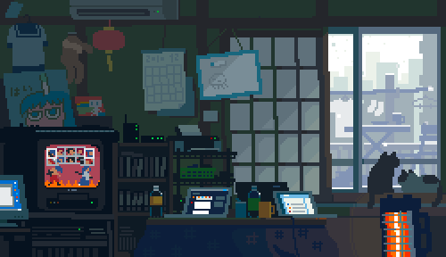

  

<h1 align="center">
  
</h1>

<h5 align="center">
  <code><a href="https://www.linkedin.com/in/md-talath-un-nabi/" title="LinkedIn Profile">LinkedIn</a></code>
  <code><a href="https://app.daily.dev/xyryc" title="CodeForces Profile">daily.dev</a></code>
  <code><a href="https://twitter.com/ANick20068930" title="Twitter Profile">Twitter</a></code>
  <code><a href="#" title="Instagram Profile">Instagram</a></code>
</h5>
 

  Welcome to my GitHub profile! I'm a passionate developer with a love for creating innovative and user-friendly applications. Here's a bit about me:
   
   

## 🔧 Technologies & Tools

- **Languages:** HTML, CSS, JavaScript, Python
- **Frameworks:** Tailwind CSS, DaisyUI, React, Node.js
- **Tools:** Git, GitHub, VS Code, Figma
- **Learning:** TypeScript, Next.js

## 🌱 What I'm Currently Working On

- Building responsive websites using **Tailwind CSS** and **DaisyUI**
- Exploring **TypeScript** and enhancing my frontend skills
- Contributing to open-source projects

 

<h2 align="center">⚡ Stats ⚡</h2>

 

  

    
    
  

             
  

    
  

- ⚡ Fun fact: Game Developers Get To Play Games As Part Of Their Job

  

